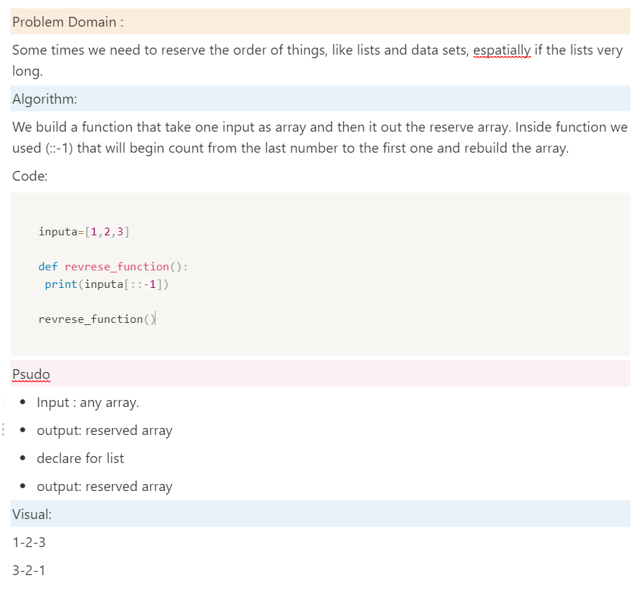

# Reverse an Array
Some times we need to reserve the order of things, like lists and data sets, espatially if the lists very long.
this algorithem take any array and reserve it.

## Whiteboard Process

## Approach & Efficiency
<!-- What approach did you take? Discuss Why. What is the Big O space/time for this approach? -->
