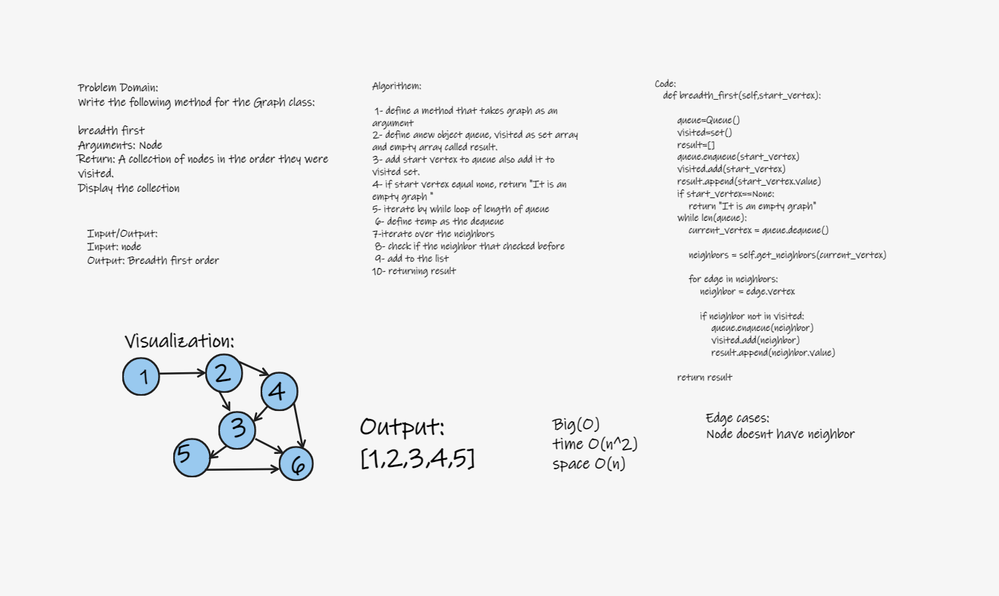

# Challenge Summary

Write a method that called a breadth first that take a Arguments: Node and Return: A collection of nodes in the order they were visited.

## Whiteboard Process

## Approach & Efficiency

The Efficiency of the Big O time is O(n^2)

The Efficiency of the Big O space is O(n)

## Solution

Write the following method for the Graph class:

        breadth first
        Arguments: Node
        Return: A collection of nodes in the order they were visited.
        Display the collection

