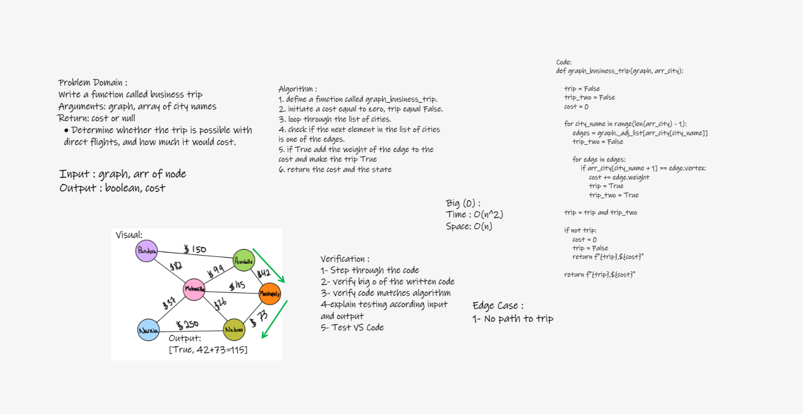

# Challenge Summary

Write a function called business trip that take arguments: graph, array of city names and return: cost or null.

## Whiteboard Process

## Approach & Efficiency

The Efficiency of the Big O time is O(n^2)

The Efficiency of the Big O space is O(n)

## Solution

Write a function called business trip

    Arguments: graph, array of city names
    Return: cost or null
