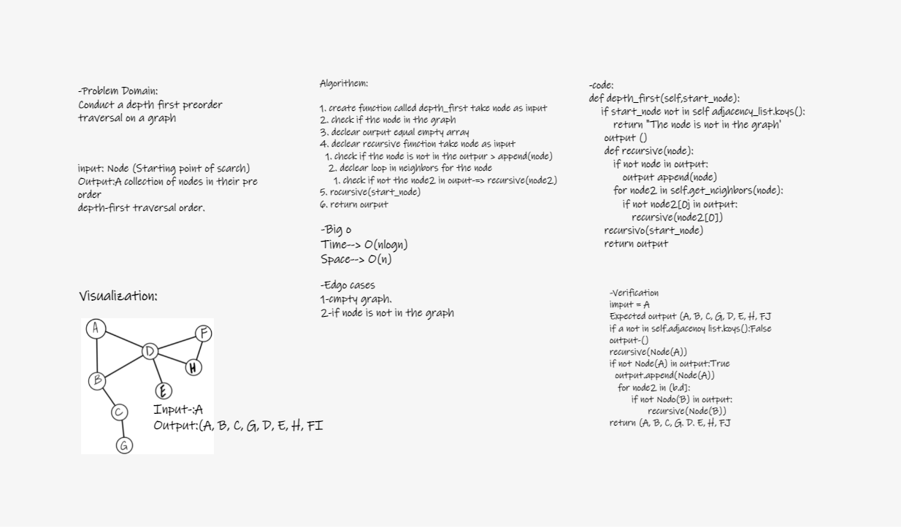

# Graph Depth First

Conduct a depth first preorder traversal on a graph.

# Challenge Summary


Write the following method for the Graph class:

* depth first
* Arguments: Node (Starting point of search)
* Return: A collection of nodes in their pre-order depth-first traversal order
* Display the collection


## Whiteboard Process



## Approach & Efficiency

1. create function called depth_first take node as input
2. check if the node in the graph
3. declear ourput equal empty array
4. declear recursive function take node as input
    1. check if the node is not in the outpur ==> append(node)
    2. declear loop in neighbors for the node
        1. check if not the node2 in ouput==> recursive(node2)
5. recursive(start_node)
6. return ourput


* Time--> O(nlog(n))
* space--> O(n)


## Solution

```
input = A
Expected output =[A, B, C, G, D, E, H, F]

if a not in self.adjacency_list.keys():False
output=[]

recursive(Node(A))

if not Node(A) in output:True
    output.append(Node(A))
     for node2 in [b,d]:
            if not Node(B) in output:
                    recursive(Node(B))
....

return 	[A, B, C, G, D, E, H, F]

```
