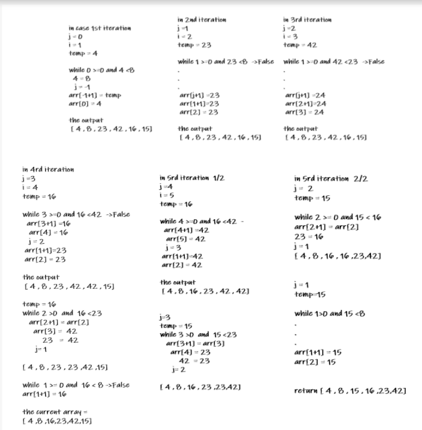

# Insertion sort

### The function which will go through it


• sample array :

arr= [8 , 4 , 23 , 42 , 16 , 15 ]


## Pseudo Code
```
SelectionSort(int[] arr)
    DECLARE n <-- arr.Length;
    FOR i = 0; i to n - 1
        DECLARE min <-- i;
        FOR j = i + 1 to n
            if (arr[j] < arr[min])
                min <-- j;

        DECLARE temp <-- arr[min];
        arr[min] <-- arr[i];
        arr[i] <-- temp;
```

## Implemented Code [tested]
```
  def InsertionSort(arr):
        for i in range (1,len(arr)) :
            j = i -1
            temp = arr[i]

            while j >= 0 and temp<arr[j:
                arr[j+1] = arr[j]
                j-=1
            arr[j+1]=temp
        return arr
```

### Visualization and trace of code :



 **************************

### Efficency

• Time: O(n^2)
The basic operation of this algorithm is comparison. This will happen n * (n-1) number of times…concluding the algorithm to be n squared.


• Space: O(1)
No additional space is being created. This array is being sorted in place…keeping the space at constant O(1).
