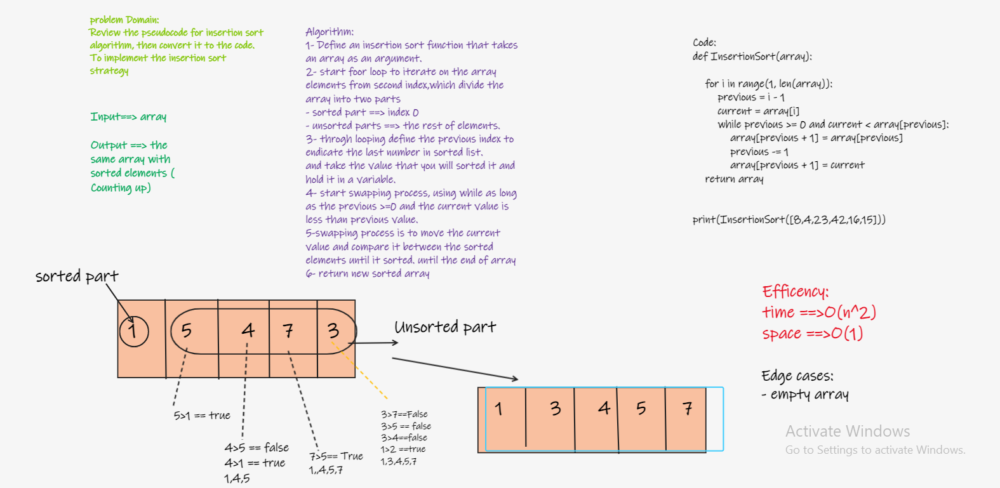

# Insertion-Sort

* Insertion sort algorithm
Insertion sort is a simple sorting algorithm that works similar to the way you sort playing cards in your hands.

* The array is virtually split into a sorted and an unsorted part. Values from the unsorted part are picked and placed at the correct position in the sorted part.
---

## BIG O_________

- Time: O(n^2)
- Space: O(1)

---
## whiteboard proces

## Solution

- To sort an array of size n in ascending order:
1. Choose a key, starting from index 11 to n-1n−1, where nn is the length of the array.

2. Keep swapping the key with all the larger values on its left side until a value less than or equal to the key occurs, or index 00 is reached.

3. Select the next index as the key. Repeat step 2.

---

