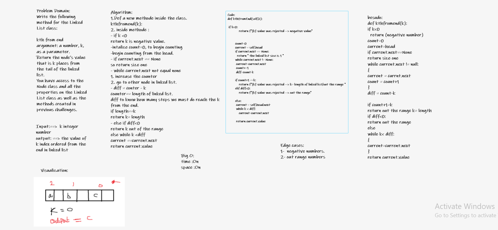

# Challenge Summary
-the value from the end of a linked list.

#### Specifications
- Read all of these instructions carefully.
- Name things exactly as described.
- Do all your work in a your data-structures-and-algorithms public repository.
- Create a new branch in your repo named as noted below.
- Follow the language-specific instructions for the challenge type listed below.
- Update the “Table of Contents” - in the README at the root of the repository - with a link to this challenge’s README file.

## Whiteboard Process

## Approach & Efficiency
## BIG O_________

- > time(Kth) --> O(n)
- > space(Kth) --> O(1)

## Testing

- [x] Where k is greater than the length of the linked list

- [x] Where k and the length of the list are the same

- [x] Where k is not a positive integer

- [x] Where the linked list is of a size 1

- [x] “Happy Path” where k is not at the end, but somewhere in the middle of the linked list

---

## solution
- Find k’th node from the end of a linked list
calculate the total number of nodes n in the linked list first, then the K Th node from the end will be (n-k+1) node from the beginning.

