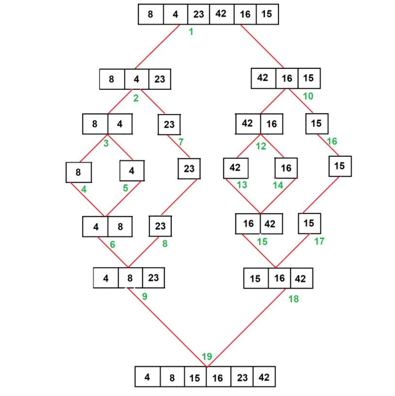

# Merge Sort

-  Merge Sort is a Divide algorithm. It divides the input array into two halves, calls itself for the two halves, and then merges the two sorted halves. The merge() function is used for merging two halves. The merge(arr, l, m, r) is a key process that assumes that arr[l..m] and arr[m+1..r] are sorted and merges the two sorted sub-arrays into one.


---

## pseudo code

```py
ALGORITHM Mergesort(arr)
    DECLARE n <-- arr.length

    if n > 1
      DECLARE mid <-- n/2
      DECLARE left <-- arr[0...mid]
      DECLARE right <-- arr[mid...n]
      // sort the left side
      Mergesort(left)
      // sort the right side
      Mergesort(right)
      // merge the sorted left and right sides together
      Merge(left, right, arr)

ALGORITHM Merge(left, right, arr)
    DECLARE i <-- 0
    DECLARE j <-- 0
    DECLARE k <-- 0

    while i < left.length && j < right.length
        if left[i] <= right[j]
            arr[k] <-- left[i]
            i <-- i + 1
        else
            arr[k] <-- right[j]
            j <-- j + 1

        k <-- k + 1

    if i = left.length
       set remaining entries in arr to remaining values in right
    else
       set remaining entries in arr to remaining values in left
```
---

## Trace


---

## Efficiency


* The above recurrence can be solved either using the Recurrence Tree method or the Master method. It falls in case II of Master Method and the solution of the recurrence is θ(nLogn). Time complexity of Merge Sort is  θ(nLogn) in all 3 cases (worst, average and best) as merge sort always divides the array into two halves and takes linear time to merge two halves.
Auxiliary Space: O(n)
Algorithmic Paradigm: Divide and Conquer
Sorting In Place: No in a typical implementation
Stable: Yes

---

## Code

```py

def mergeSort(arr):

    if len(arr) > 1:

        mid = len(arr)//2

        left = arr[:mid]
        right = arr[mid:]

        mergeSort(left)

        mergeSort(right)

        merge(left, right, arr)

    return arr


def merge(left, right, arr):
    i = j = k = 0

    while i < len(left) and j < len(right):
        if left[i] < right[j]:
            arr[k] = left[i]
            i += 1
        else:
            arr[k] = right[j]
            j += 1
        k += 1


    while i < len(left):
        arr[k] = left[i]
        i += 1
        k += 1


    while j < len(right):
        arr[k] = right[j]
        j += 1
        k += 1

```
---

## Tests

```py
def test_mergeSort_1():
    #arrang
    arr = [12, 11, 13, 5, 6, 7]
    #act
    actual =  mergeSort(arr)
    #expected
    expected = [5, 6, 7, 11, 12, 13]
    assert actual == expected


def test_mergeSort_2():
    #arrang
    arr = [20, 18, 12, 8, 5, -2]
    #act
    actual = mergeSort(arr)
    #expected
    expected = [-2, 5, 8, 12, 18, 20]
    assert actual == expected


def test_mergeSort_3():
    #arrang
    arr = [5, 12, 7, 5, 5, 7]
    #act
    actual = mergeSort(arr)
    #expected
    expected = [5, 5, 5, 7, 7, 12]
    assert actual == expected


def test_mergeSort_4():
    #arrang
    arr = [2, 3, 5, 7, 13, 11]
    #act
    actual = mergeSort(arr)
    #expected
    expected = [2, 3, 5, 7, 11, 13]
    assert actual == expected
```
