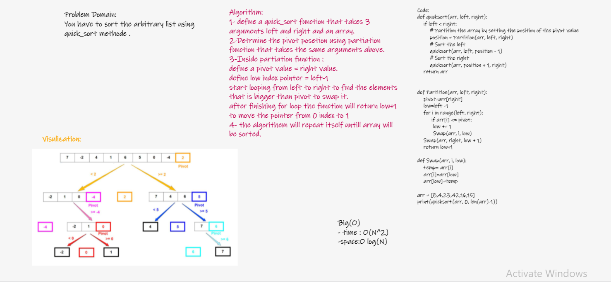

# Challenge Summary
> You have to sort the arbitrary list using quick_sort methode .

## Whiteboard Process

## Approach & Efficiency

>  Time Complexity : O(n2) It occurs when the pivot element picked is either the greatest or the smallest element.
 
Space Complexity : O(log(N)) Because quick sort calls itself log(n) times.

