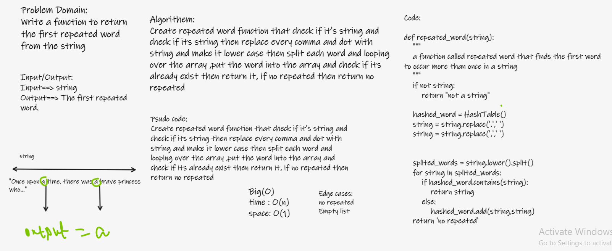

## Challenge Summary
 create a function that finds the first word to occur more than once in a string

 ## Whiteboard Process

## Approach & Efficiency

- time: O(1)
- space O(1)

## Solution:
- repeated_word(str): that takes an argument a str and return the first duplicate value
