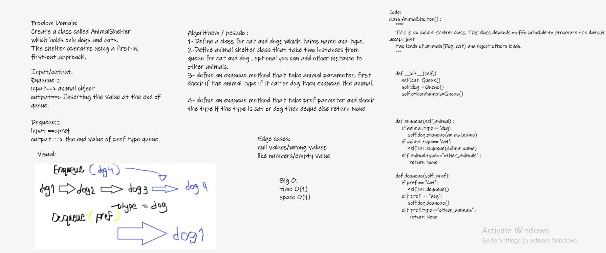

# Challenge Summary
###### Create a class called AnimalShelter which holds only dogs and cats.
- The shelter operates using a first-in, first-out approach.
###### Implement the following methods:
1. enqueue
- Arguments: animal
- animal can be either a dog or a cat object.
2. dequeue
1. Arguments: pref
- pref can be either "dog" or "cat"
- Return: either a dog or a cat, based on preference.
- If pref is not "dog" or "cat" then return null.

## Whiteboard Process

<!-- What approach did you take? Why? What is the Big O space/time for this approach? -->
### Approach/ Effitincy:

I took the approach of creating a class for dog and cat and take instances from Queue class in AnimalShelter class .
I added the attributes name,type for each dog, cat class. and check it in enqueuing and dequeuing

## Solution

<!-- Show how to run your code, and examples of it in action -->

define a class for do and cat which takes name and type for both.

define animal shelter class , and take instance from for cat and dog from the Queue.

define method enqueue which take animal parameter we check for both cases if the type of animal is dog or cat then enqueue it .

define method dequeue which take "pref" as parameter and we check about it if cat or dog then enqueue it .
else return Null.
