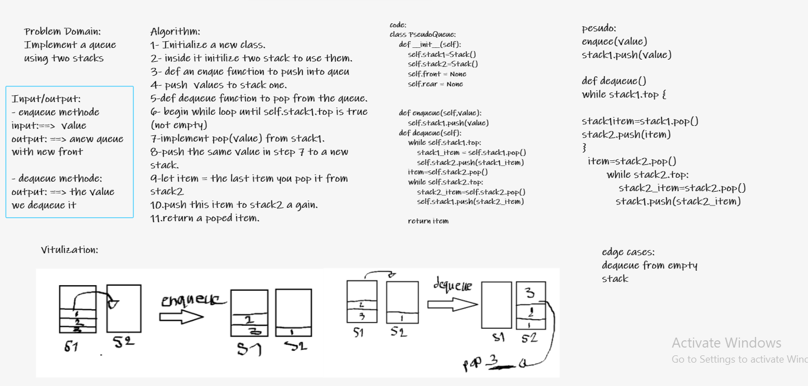

# Challenge Summary
- Create a new class called pseudo queue.
- Do not use an existing Queue.
- Instead, this PseudoQueue class will implement our standard queue interface (the two methods listed below),
- nternally, utilize 2 Stack instances to create and manage the queue
#### Methods:
##### enqueue
A- rguments: value
- Inserts value into the PseudoQueue, using a first-in, first-out approach.
##### dequeue
- Arguments: none
- Extracts a value from the PseudoQueue, using a first-in, first-out approach.h
- NOTE: The Stack instances have only push, pop, and peek methods. You should use your own Stack implementation. Instantiate these Stack objects in your PseudoQueue constructor.

## Whiteboard Process

## Approach & Efficiency
O(1) for Enqueue or Dequeue
O(n) for Enqueue or Dequeue

