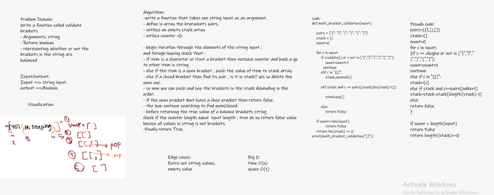

# Challenge Summary
-#### Write a function called validate brackets
- Arguments: string
- Return: boolean
- representing whether or not the brackets in the string are balanced
- There are 3 types of brackets:

1. Round Brackets : ()
2. Square Brackets : []
3. Curly Brackets : {}

## Whiteboard Process

## Approach & Efficiency
to solve this problem I used  fifo approach to search to balanced brackets.
Efficiency is O(n) for time and O(1) space.

## Solution
see stack_queue_brackets.py file and the tests in tests folder
