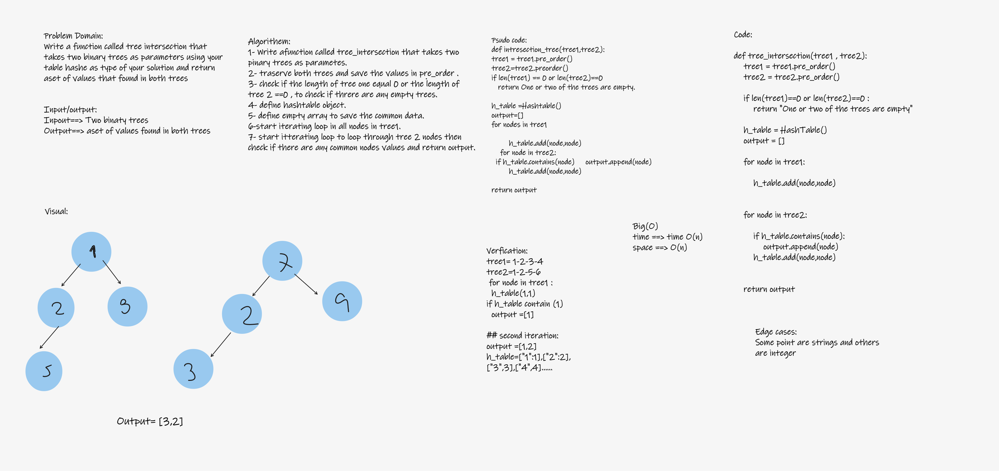

# tree_intersection

## Challenge

- Write a function called tree_intersection that takes two binary trees as parameters.
- Using your Hashmap implementation as a part of your algorithm, return a set of values found in both trees.

 

---

---

## whiteboard proces

---

## Big O_________

- Time --> O(n).

- Space --> O(n).

 

---

## Testing

- [x] test_tow_numbers_tree_intersections
- [x] test_empty_trees_intersection

