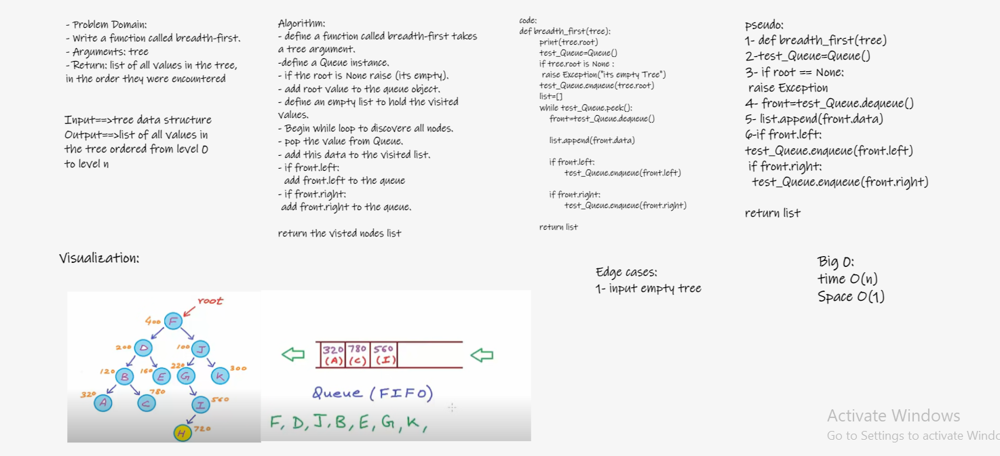

## Trees
Trees Data Structure represent nodes connected by edges.

## Challenge
- Write a function called breadth first
- Arguments: tree
- Return: list of all values in the tree, in the order they were encountered
NOTE: Traverse the input tree using a Breadth-first approach

## White Board :

## Approach & Efficiency
- breadth first: time O(n), space O(1)

## Structure and Testing

> [x] test_tree_breadth_first

## Solution:

Shown in white Board image and in tree_breadth_first.py in trees
Folder
