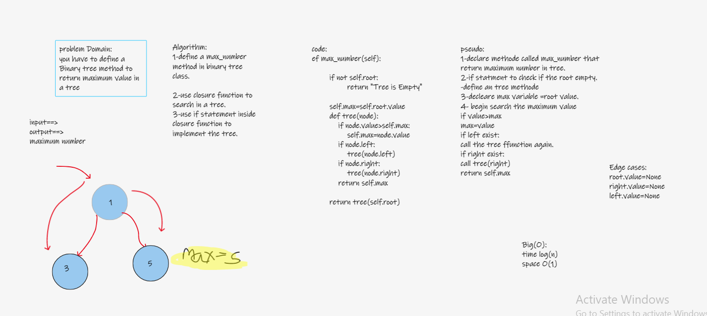

## Trees
Trees Data Structure represent nodes connected by edges.

## Challenge
- to build Binary_Tree class Define a method for each of the depth first traversals:

    - pre order
    - in order
    - post order
    - max

- Create a Binary Search Tree class  Define methods :
    - Add
    - Contains

## White Board:

## Approach & Efficiency
- max: time O(n), space O(1)
- pre order: time O(n), space O(n)
- in order: time O(n), space O(n)
- post order: time O(n), space O(n)
- Add: time O(logn), space O(1)
- Contains: time O(logn), space O(1)

## API

- pre order: method that return tree in order < node=> left=> right >
- in order: method that return tree in order < left=> node=> right >
- post order: method that return tree in order < left=> right=> node >
- Add: to add a value to a tree by binary search algorithm
- Contains: to check if the tree contains a value
