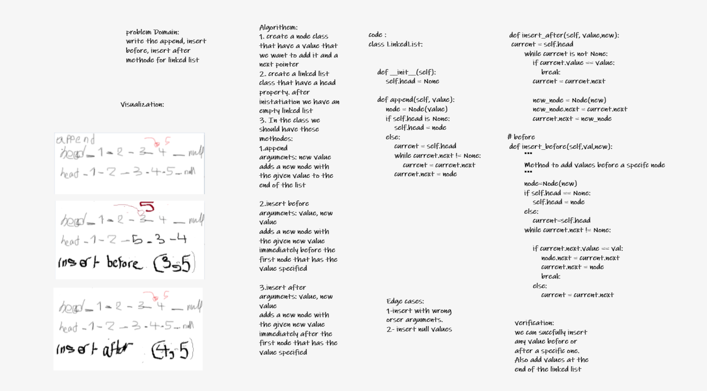

# Challenge Summary
#### Write the following methods for the Linked List class:

- append
arguments: new value
adds a new node with the given value to the end of the list
- insert before
arguments: value, new value
adds a new node with the given new value immediately before the first node that has the value specified
- insert after
arguments: value, new value
adds a new node with the given new value immediately after the first node that has the value specified

#### Write tests to prove the following functionality:

- Can successfully add a node to the end of the linked list
- Can successfully add multiple nodes to the end of a linked list
- Can successfully insert a node before a node located i the middle of a linked list
- Can successfully insert a node before the first node of a linked list
- Can successfully insert after a node in the middle of the linked list
- Can successfully insert a node after the last node of the linked list
## Whiteboard Process

## Approach & Efficiency
Classes and methods , nodes and and linked lists.
| Method | Time | Space |
| ----------- | ----------- | ------------- |
| Insert | O(1) | O(1) |
| Includes | O(n) | O(1) |
| Print | O(n) | O(1) |

## Solution
<!-- Show how to run your code, and examples of it in action -->
The solution is the algorithem and a test files inside a linked list folder
